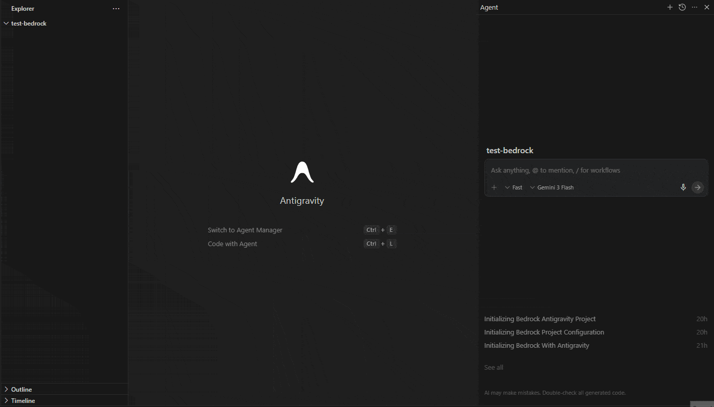
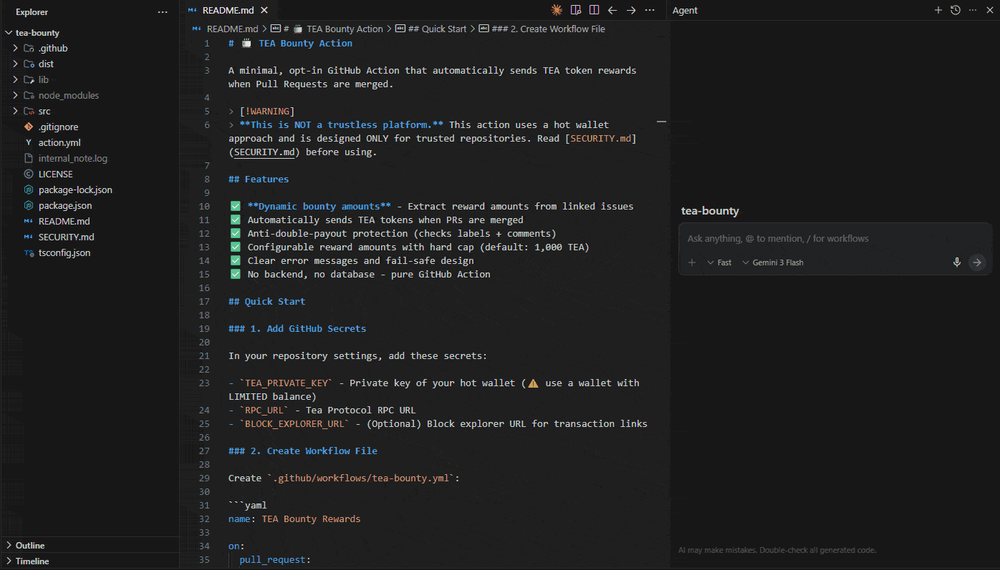
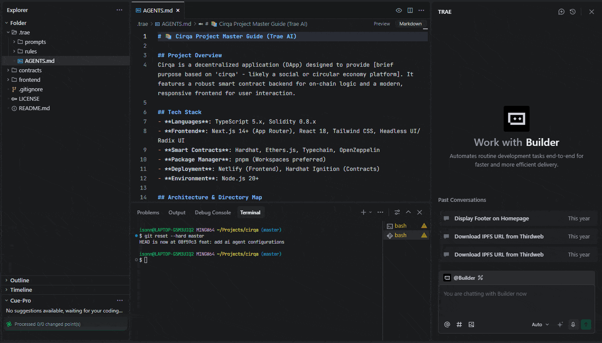

<h1 align="center">🪨 Bedrock</h1>

<p align="center">
  <strong>One command. Production-grade AI configuration for your entire project.</strong>
</p>

<p align="center">
  Bootstrap AI-ready configs for Claude Code, Cursor, Trae, and Antigravity — tailored to your exact tech stack, in seconds.
</p>

<p align="center">
  
  
  
  
  
  <a href="https://github.com/sponsors/isonnymichael"></a>
</p>

<p align="center">
  <a href="#-why-bedrock">Why Bedrock</a> •
  <a href="#-getting-started">Getting Started</a> •
  <a href="#-usage">Usage</a> •
  <a href="#-enhance">Enhance</a> •
  <a href="#-supported-ai-tools">Supported Tools</a> •
  <a href="#-contributing">Contributing</a>
</p>

---

## The Problem

You set up an AI agent. It writes decent code — but it doesn't know your stack, your conventions, or your rules. You spend more time correcting it than shipping.

The fix is a well-structured config: a master guide, formatting rules, testing standards, security guardrails. But writing all that from scratch takes hours — and it drifts the moment your stack changes.

**Bedrock generates all of it in one command.**

---

## Demo

**Initialize on a fresh project:**



**Initialize on an existing project (auto-detected):**



**Keep configs in sync as your project evolves:**



---

## ✨ Features

- **Multi-tool support** — Claude Code, Cursor, Trae, Antigravity (Gemini)
- **Context-aware generation** — Auto-scans existing projects, or take a description for new ones
- **Production-grade output** — Master guide, formatting rules, testing standards, security guardrails, workflows, skills
- **Zero setup** — Paste one prompt into your AI agent chat and it writes every config file automatically
- **Enhance, don't redo** — Keep configs in sync as your stack evolves with a single command
- **Extensible** — Clean generator architecture makes adding new tools straightforward

---

## 🚀 Getting Started

**Requirements:** Node.js 18+

Bedrock is designed to be invoked through your AI agent chat — not run directly in a terminal. The agent runs the command, reads the output, and writes every config file into your project automatically.

---

## 📖 Usage

**Step 1 — Open your AI agent chat** (Claude Code, Cursor, Trae, Antigravity, etc.)

**Step 2 — Paste this prompt:**

```
Run `npx @isonnymichael/bedrock init` and execute the results
```

Bedrock auto-detects your project structure and picks the right tool. To target a specific tool:

```
Run `npx @isonnymichael/bedrock init --tool <tool>` and execute the results
```

With a project description for more tailored output:

```
Run `npx @isonnymichael/bedrock init --tool <tool> --about "<description>"` and execute the results
```

**Step 3 — Done.** The agent writes all config files into your project.

---

**Flags:**

| Flag | Required | Description |
|------|----------|-------------|
| `-t, --tool <tool>` | No | AI tool to configure: `claude`, `antigravity`, `trae`, `cursor`. Auto-detected if omitted. |
| `-a, --about <description>` | No | Project description. Auto-detected from project structure if omitted. |

---

### Examples

#### Claude Code

```
Run `npx @isonnymichael/bedrock init --tool claude` and execute the results
```

```
Run `npx @isonnymichael/bedrock init --tool claude --about "A multi-tenant SaaS REST API built with Node.js 20, Express, PostgreSQL, and Prisma ORM. Handles billing via Stripe and auth via JWT."` and execute the results
```

#### Cursor

```
Run `npx @isonnymichael/bedrock init --tool cursor` and execute the results
```

```
Run `npx @isonnymichael/bedrock init --tool cursor --about "A Go microservices backend using gRPC for inter-service communication, deployed on Kubernetes."` and execute the results
```

#### Trae

```
Run `npx @isonnymichael/bedrock init --tool trae` and execute the results
```

```
Run `npx @isonnymichael/bedrock init --tool trae --about "A fullstack app with Vue 3 (Composition API, TypeScript) frontend and a FastAPI Python backend. PostgreSQL, SQLAlchemy, Docker Compose."` and execute the results
```

#### Antigravity (Gemini)

```
Run `npx @isonnymichael/bedrock init --tool antigravity` and execute the results
```

```
Run `npx @isonnymichael/bedrock init --tool antigravity --about "A Python 3.12 data pipeline using Apache Airflow, dbt for transformations, and BigQuery as the warehouse."` and execute the results
```

---

### Writing a Good `--about` Description

The more specific you are, the more tailored the config. Include:

- **Language and runtime** with version — `Node.js 20`, `Python 3.12`, `Go 1.22`
- **Frameworks** — `Next.js 14 App Router`, `FastAPI`, `Vue 3 Composition API`
- **Database and ORM** — `PostgreSQL with Prisma`, `MongoDB with Mongoose`
- **Package manager** — `pnpm`, `npm`, `yarn`, `pip`, `cargo`
- **Key integrations** — `Stripe`, `Auth0`, `AWS S3`
- **Deployment target** — `Vercel`, `AWS ECS`, `Kubernetes on GKE`
- **Testing tools** — `Vitest`, `pytest`, `Playwright`

**Weak:**
```
A web app with a backend and database
```

**Strong:**
```
A multi-tenant SaaS built with Next.js 14 App Router, NestJS REST API, PostgreSQL with Prisma ORM,
Redis for caching and sessions, and Stripe for billing. Deployed on Vercel and AWS ECS. Vitest + Playwright.
```

---

## 🔄 Enhance

Your stack changes. New libraries, new services, new architecture. Your AI configs shouldn't fall behind.

The `enhance` command reads your existing configs, scans your current project, and generates a targeted update prompt — so your AI agent knows exactly what to change.

```
Run `npx @isonnymichael/bedrock enhance` and execute the results
```

Or describe what changed:

```
Run `npx @isonnymichael/bedrock enhance --about "Added Redis caching and switched from REST to GraphQL"` and execute the results
```

**Options:**

| Flag | Required | Description |
|------|----------|-------------|
| `-a, --about <description>` | No | Describe what changed. Inferred from project structure if omitted. |

Bedrock auto-detects existing configs (`.claude/`, `.agents/`, `.trae/`, `.cursor/rules/`) and enhances all of them at once. If none are found, it tells you to run `init` first.

**The AI will:**

1. Update the master guide to reflect new frameworks, services, or architecture
2. Correct outdated versions and tool references
3. Add rules for newly introduced technologies
4. Remove or rewrite rules for removed dependencies
5. Preserve existing custom rules and team decisions
6. Generate any missing expected config files

### More enhance examples

```
Run `npx @isonnymichael/bedrock enhance --about "Added a Python ML inference service alongside the existing Node.js API"` and execute the results
```

```
Run `npx @isonnymichael/bedrock enhance --about "Migrated from Webpack to Vite, upgraded to React 19 and TypeScript 5.5"` and execute the results
```

```
Run `npx @isonnymichael/bedrock enhance --about "Introduced Kubernetes, added Helm charts, set up GitHub Actions CI/CD"` and execute the results
```

---

## 🤖 Supported AI Tools

| Tool | Value | Config Location | Files Generated |
|------|-------|----------------|-----------------|
| **Claude Code** | `claude` | `.claude/` | `CLAUDE.md`, rules, slash commands, skills |
| **Antigravity (Gemini)** | `antigravity` | `.agents/` | `GEMINI.md`, rules, workflows, skills |
| **Trae** | `trae` | `.trae/` | `AGENTS.md`, rules, prompts |
| **Cursor** | `cursor` | `.cursor/rules/` | `.mdc` rule files for all categories |

### What Gets Generated

Each config set includes:

- **Master Guide** — Primary instruction file loaded at the start of every session
- **Code Formatting Rules** — Indentation, naming conventions, import ordering, gold-standard snippets
- **Testing Standards** — Framework recommendations, coverage thresholds, test structure examples
- **Security Guardrails** — Input validation, secrets management, vulnerability prevention
- **Architecture Guidelines** — Layer boundaries, module dependencies, API design conventions
- **Workflows / Commands** — Reusable review, documentation, onboarding, and refactoring workflows
- **Skills** — Debugging skill templates with step-by-step instructions

---

## 💡 Tips

**Run it before you write any code.**
The best time to initialize is before you start. Bedrock sets the conventions your AI agent will follow from day one, preventing config drift and inconsistency later.

**Be specific with your tech stack.**
Vague descriptions produce generic configs. Detailed ones produce configs your AI agent can actually enforce.

**Use `enhance` when your stack changes, not `init`.**
`enhance` preserves your customizations and updates only what changed. Use `init` only for fresh setups.

**Commit the generated files.**
Check `.claude/`, `.agents/`, `.trae/`, or `.cursor/rules/` into version control. Every teammate and CI environment gets the same AI behavior.

**Multiple tools? Run once per tool.**
Each run generates a separate, self-contained config folder — they don't conflict.

---

## 📁 Project Structure

```
bedrock/
├── bin/
│   └── bedrock.cjs          # CLI entrypoint
├── src/
│   ├── index.js             # Commander.js program setup
│   ├── commands/
│   │   ├── init.js          # `bedrock init` command logic
│   │   └── enhance.js       # `bedrock enhance` command logic
│   ├── generators/
│   │   ├── antigravity.js   # Init prompt generator for Antigravity (Gemini)
│   │   ├── claude.js        # Init prompt generator for Claude Code
│   │   ├── cursor.js        # Init prompt generator for Cursor
│   │   ├── trae.js          # Init prompt generator for Trae
│   │   └── enhance.js       # Enhance prompt generator (all tools)
│   └── utils/
│       ├── fs-helpers.js    # File system utilities
│       └── config-reader.js # Reads existing AI config files
└── package.json
```

---

## 🤝 Contributing

Contributions are welcome. The most valuable areas:

- **New tool generators** — Add support for a new AI coding tool (Windsurf, Copilot, etc.)
- **Generator improvements** — Better prompts, more categories, richer output
- **Bug fixes** — Open an issue first if you're unsure

### Adding a New Generator

1. Create `src/generators/<tool-name>.js`
2. Export a `generate<ToolName>(context)` async function that returns a prompt string
3. Import and wire it up in `src/commands/init.js`

The `context` object passed to every generator:

```js
{
  isFresh: Boolean,        // true if project has no existing files
  projectAbout: String,    // user-provided description (may be empty)
  projectStructure: String // scanned directory tree (existing projects only)
}
```

---

## 🛠️ Development

```bash
git clone https://github.com/isonnymichael/bedrock.git
cd bedrock
npm install

# Test locally (direct execution — for development only)
node bin/bedrock.cjs init --tool claude --about "my project"
```

---

## 📄 License

GPL-3.0 © Sonny Michael

---

<p align="center">
  If Bedrock saved you time, consider giving it a ⭐ — it helps others find it.<br>
  Want to support ongoing development? <a href="https://github.com/sponsors/isonnymichael">Sponsor on GitHub ♥</a>
</p>
